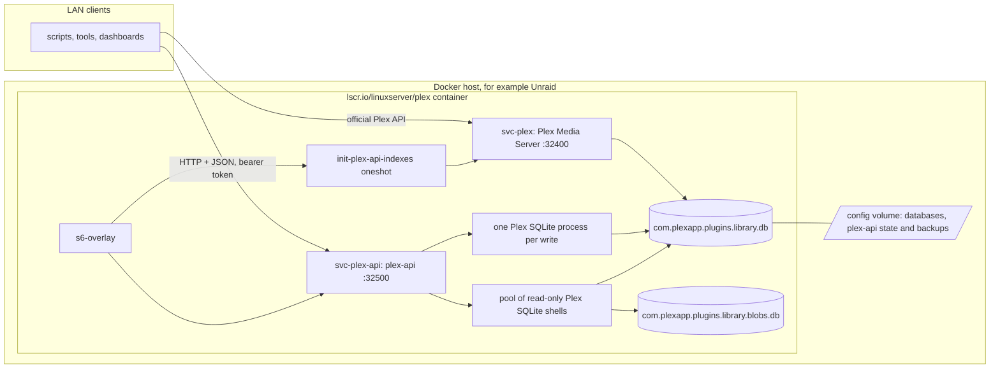
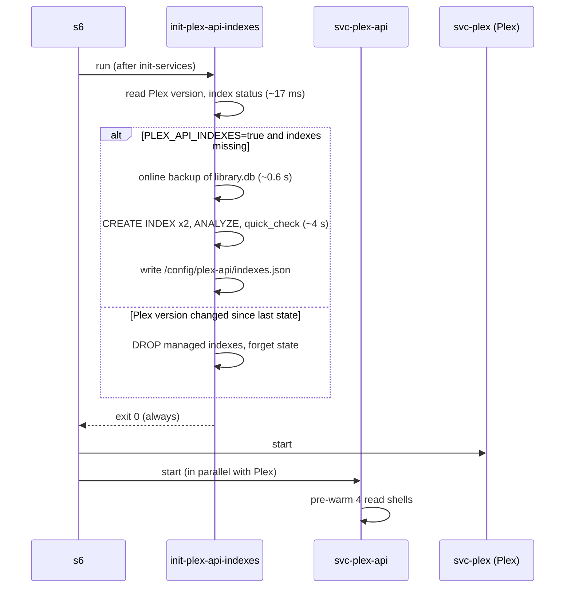
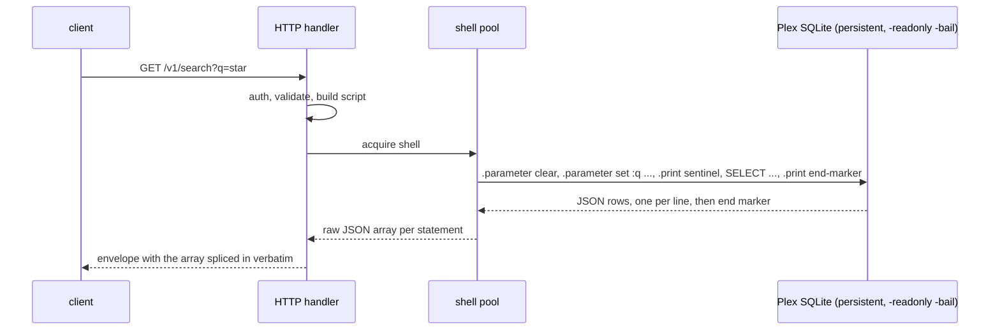

# Architecture and topology

plex-api is one static Go binary that runs inside the linuxserver.io Plex container and
exposes the Plex library SQLite databases over HTTP. It links no SQLite library. Every
query runs through Plex's own SQLite build, because that is the only engine that knows
Plex's `collating` full-text tokenizer and `icu_root` collation (see
`PlexDirectAccessFeasibility.md` for the evidence).

## Topology

Everything in the container shares one filesystem and one user (`abc`), so plex-api reads
the same files Plex writes, with the same permissions, and can tell whether Plex is
running by probing its port.

## Delivery: a linuxserver docker mod

The mod is a single-layer `FROM scratch` image containing the binary and an s6 overlay.
The container downloads and unpacks it at every start when `DOCKER_MODS` names it. Only
the first layer of a mod image is installed, which is why `deploy/Dockerfile.mod`
assembles everything in the build stage and copies it once. For private testing,
`deploy/Dockerfile.layer` produces a derived Plex image with the same files.

Files installed:

| Path | Role |
| --- | --- |
| `/usr/local/bin/plex-api` | the service and its CLI modes |
| `/etc/s6-overlay/s6-rc.d/svc-plex-api/` | long-running service, port 32500, depends on `init-services` only |
| `/etc/s6-overlay/s6-rc.d/init-plex-api-indexes/` | oneshot that manages the extra indexes |
| `/etc/s6-overlay/s6-rc.d/svc-plex/dependencies.d/init-plex-api-indexes` | makes Plex wait for the oneshot |

## Start-up sequence

The oneshot always exits zero so Plex is never blocked by an index problem. Because Plex
depends on the oneshot, index creation happens while Plex is not running, without any
stop and start. The version check drops the indexes ahead of a Plex upgrade so Plex's
migrations run on an unmodified schema; the indexes return on the following start.

## Request path

Key points of the design:

- **Reads use a pool** of long-lived shells (default 4, `PLEX_API_POOL`). Parameters are
  cleared per request, shells are recycled after `PLEX_API_POOL_MAX_USES`, and a shell
  that errors or times out is discarded and respawned. Raw SQL is pooled only when every
  statement is SELECT, WITH, VALUES or EXPLAIN; anything else gets a private process.
- **Writes spawn a private process** per request and run inside
  `BEGIN IMMEDIATE ... COMMIT` with `-bail`, so an error aborts before COMMIT and nothing
  is written. Writes are off by default and, when on, refused while Plex is running
  unless explicitly allowed.
- **Rows are never decoded and re-encoded.** The shell's JSON is passed through, which
  keeps SELECT column order and makes large pages cost about what the engine costs.
- **Parameters are bound, not interpolated.** Values go through the shell's
  `.parameter set` as SQL literals; strings with quotes or control characters are
  rendered as `char(...)` because the dot-command has no quote escaping.

## Configuration surface

| Variable | Default | Effect |
| --- | --- | --- |
| `PLEX_API_BIND` | `0.0.0.0:32500` | listen address |
| `PLEX_API_TOKEN` | unset | bearer token required on all but `/health` |
| `PLEX_API_WRITE` | `false` | enable write endpoints |
| `PLEX_API_WRITE_WHILE_RUNNING` | `false` | allow writes while Plex listens on 32400 |
| `PLEX_API_POOL` | `4` | read shells; 0 spawns per request |
| `PLEX_API_INDEXES` | `false` | create the managed indexes at start |
| `PLEX_API_INDEX_BACKUP` | `true` | back up the main database before creating them |
| `PLEX_API_BACKUP_DIR` | `/config/plex-api/backups` | where backups go; `PLEX_API_BACKUP_KEEP` copies are kept |

The full list, with the remaining tuning variables, is in the root README.

## Where the numbers come from

`Benchmark.md` holds the head-to-head measurements against the official Plex API on a
116 thousand item library, and `PerformanceReview.md` records the optimisation passes and
what each one bought. `PlexDatabaseLayout.md` documents the schema the queries rely on.
